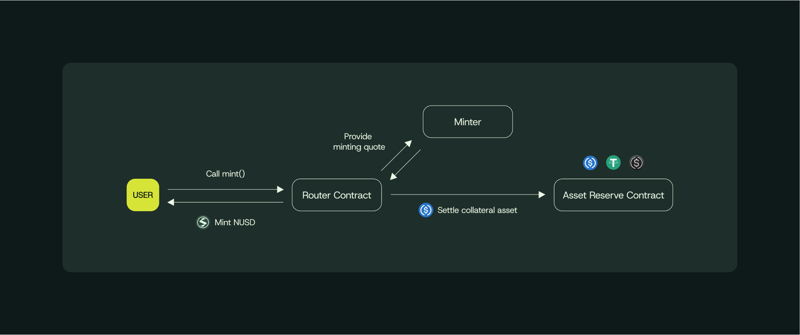

# Minting

Minting NUSD

NUSD minting is permissionless with discretionary  safeguards enforcing full collateralization, security and efficiency.

<figure><figcaption></figcaption></figure>

### Process flow

**1. Initiation**

Users interact with the `Router.sol` contract by calling the `mint()` function with the following parameters:

* Collateral asset address
* Deposit amount
* Beneficiary address for NUSD receipt

**2. Collateral Transfer**

The Router executes a transfer of collateral tokens from the user to the AssetReserve.sol contract, ensuring all backing assets remain under protocol custody before any NUSD issuance.

**3. Routing to  Minter**

Based on the collateral type, the Router delegates the minting request to the appropriate Minter contract.&#x20;

**4. Valuation & Calculation**

The Minter contract performs critical valuation steps:

* Queries on-chain price oracles&#x20;
* Determines current USD value of deposited collateral
* Calculates NUSD output amount considering:
  * **Slippage tolerance**: `order.nusdAmount` serves as minimum acceptable output
  * **Rate limits**: Enforces `maxMintPerBlock` to prevent manipulation

**5. NUSD Creation**

Upon validation of all parameters, the Minter executes:

* Calls `mint()` function on NUSD.sol contract
* Increases total NUSD supply atomically
* Credits newly minted tokens to the specified beneficiary
