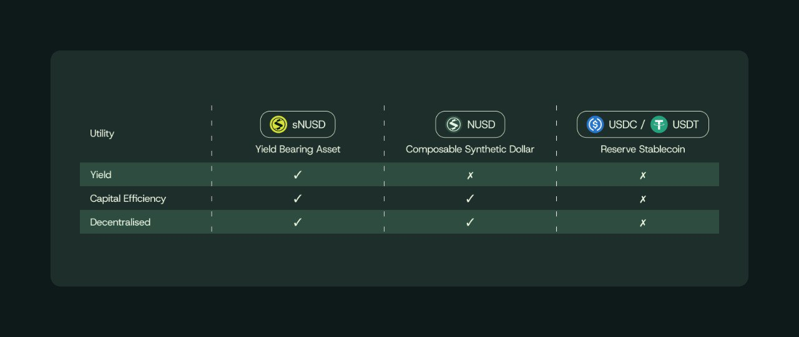

# Why Neutrl?

**Neutrl transforms the ordinary synthetic dollar into the most efficient wealth-preservation asset in crypto.**

\
Traditional on-chain dollars slowly erode your purchasing power; by contrast, Neutrl gives it steady growth by unlocking access to yield typically reserved for hedge funds, OTC desks, and high-net-worth wallets.

#### The problem

1. **Institutional-grade yield is gated.**\
   The most lucrative opportunities - carry trades, basis spreads, and funding-rate arbitrage - are locked behind the gates of OTC desks and prime brokers. These require millions of dollars in capital, established relationships, and costly legal expertise.
2. **Public stablecoins keep the profits.**\
   Leading stablecoins like USDC, USDT, and their clones earn on their collateral but pass little to nothing back to holders. Your dollar stays stagnant while the issuer reaps the rewards.
3. **DIY yield strategies are fragile.**\
   Retail yield farms are unreliable - often spiking briefly before decaying. Managing these strategies is a full-time job with many risks, including smart-contract failures, volatile returns, and systemic implosions.

#### Our answer

Neutrl simplifies the playbook for wealth generation in crypto. We combine three institutional-grade strategies - liquid basis trades, on-chain cash-equivalent rates, and arbitrage opportunities - into a single, cohesive protocol. This protocol matches durations efficiently, channels yield directly to holders, and requires no active management.

| Token     | What you get                                                                                    |
| --------- | ----------------------------------------------------------------------------------------------- |
| N**USD**  | A spendable, highly capital efficient, and composable synthetic dollar with full redeemability. |
| **sNUSD** | A high-yield synthetic dollar that auto reindexes with protocol’s net income.                   |

<figure><figcaption>
NUSD and sNUSD are fully-backed, yield-bearing, and highly capital efficient, with a clear path towards decentralized governance.
</figcaption></figure>

#### Why Neutrl's Synthetic Dollar Outperforms Legacy Stablecoins

* **Visible Yield:** Your balance grows every day; no need to chase pools or wrap your coins.
* **Always Redeemable:** NUSD is always fully redeemable for USDC and USDT by whitelisted participants
* **On-chain Risk Management:** Assets and liabilities are locked in a 1:1 duration ladder, minimizing maturity mismatches and ensuring stability.
* **Equal Access:** With no privileged access, every holder - from individuals to large institutions - earns the same institutional-grade yields, all with the same token.

By blending crypto-native trading yields with institutional-grade strategies, Neutrl unlocks a new class of decentralized, high-yield opportunities for both traders and liquidity providers.
