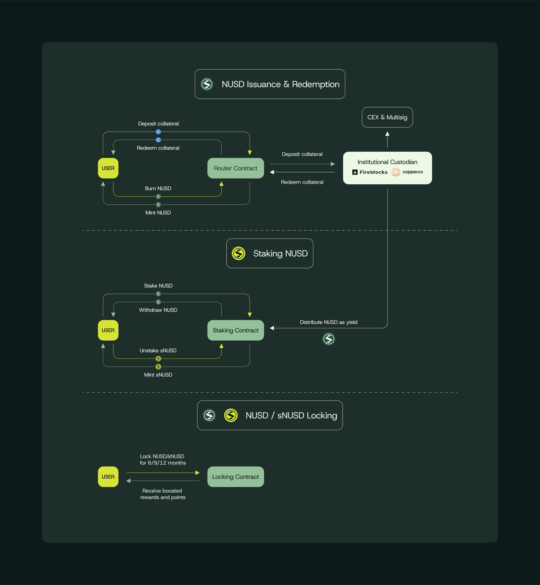

# How Neutrl Works

<figure><figcaption>
Typical Neutrl user flow: 1) Deposit → mint nUSD 2) Stake → earn sNUSD yield 3) Lock → boost rewards.
</figcaption></figure>

#### A. Minting **nUSD** (issuance & redemption)

1. **Deposit collateral**
   * Accepted assets today: **USDC, USDT, USDe**
   * Any time you send one of these tokens to the **Router Contract** the system records your deposit on-chain.
2. **Receive the receipt token**
   * The router mints **nUSD 1 : 1** against your collateral and returns it to your wallet in the same transaction.
3. **Institutional custody & deployment**
   * Collateral routes to segregated vaults at institutional custodians (Fireblocks, Copper, Ceffu etc.).
   * From there it is placed into **delta-neutral, duration-matched strategies** that power the protocol’s yield engine.
4. **Unmatched liquidity**
   * nUSD is an ERC-20—plug-and-play across CEX margin accounts, DeFi money-markets and on-chain primitives.
   * Fast redemptions (≤ T+2) plus pristine backing make it “blue-chip” collateral wherever dollars are needed.

#### B. Staking **nUSD → sNUSD**

1. **Stake**
   * Send your nUSD to the **Staking Contract** to convert it into **sNUSD**.
2. **Earn the Neutrl rate**
   * All protocol income—basis arbitrage, OTC carry, on-chain risk-free pools—flows first to a yield pool.
   * Every epoch the pool **re-indexes sNUSD balances upward**

_(Unstake at any time and you receive nUSD + accrued yield, subject to the 30-day cool-down.)_

#### C. Locking **nUSD / sNUSD / LP tokens**

1. **Choose a lock tenor**
   * Lock assets for **6 / 9 / 12 months** inside the **Locking Contract**.
2. **Boost your rewards**
   * Longer locks earn higher points → a larger slice of future emissions & incentive campaigns.
3. **Future-proof distribution**
   * The protocol may evolve to a **weighted-average-maturity** model, seamlessly routing more yield toward longer-dated lockers to keep duration perfectly balanced.
