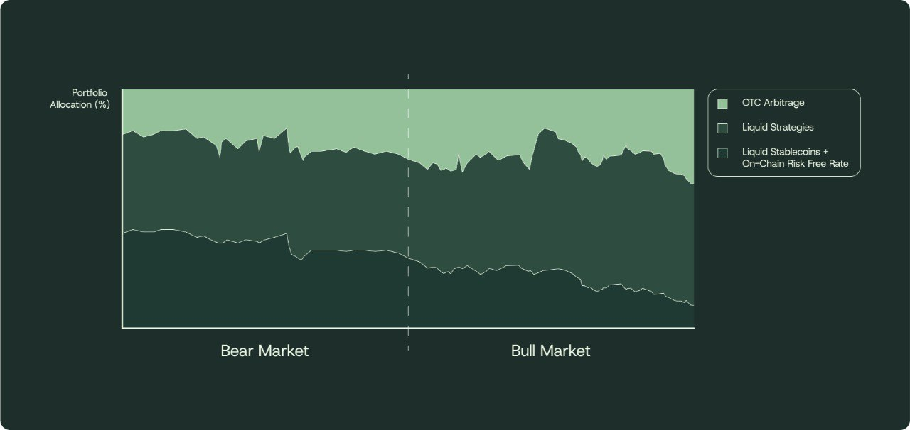

# Portfolio Allocation

The protocol’s portfolio is strategically allocated to balance liquidity, yield generation, and risk management. This allocation ensures the stability of NUSD while maximizing returns for sNUSD stakers. The portfolio can be divided into three main categories:

**1. Liquid Reserves (Stablecoins and Yield-Bearing Instruments)**

* **Allocation**:\
  A portion of the portfolio is held in highly liquid stablecoins (e.g., USDC, USDT, USDe) and yield-bearing stablecoins.
* **Purpose**:
  * Provides immediate liquidity to ensure NUSD holders can redeem 1:1 for USDC at any time.
  * Funds the **base yield** distributed to sNUSD.
* **Risk Profile**:\
  These assets are low-risk and highly liquid, ensuring the protocol can meet redemption demands and maintain stability during periods of market stress.

***

**2. Hedged OTC Positions (Discounted Assets)**

* **Allocation**:\
  The protocol allocates a portion of its portfolio to acquire crypto assets at a discount through OTC deals.
* Locked tokens are hedged to eliminate price risk, and the protocol may strategically sell or stake these assets to capture additional yield.
* **Risk Profile**:\
  While OTC positions carry slightly higher risk due to market and liquidity factors, the protocol mitigates this through diversification, hedging, and careful risk management.

***

**3. Delta-Neutral Yield Strategies**

* **Allocation**:\
  A portion of the portfolio is deployed in delta-neutral strategies, such as:
  * Perpetual futures funding arbitrage.
  * Basis trading (e.g., capturing spreads between spot and futures markets).
* **Purpose**:
  * Generates consistent, low-risk yield by exploiting inefficiencies in derivatives markets.
  * Ensures a steady stream of revenue without exposing the portfolio to directional price risk.
* **Risk Profile**:\
  These strategies are market-neutral and designed to minimize exposure to volatile price movements, making them a reliable source of yield, while still being liquid enough to meet redemptions.

***

#### Duration Matching Approach

<figure><figcaption>
 Illiquid OTC assets may be selected with matched durations based on known maturities of liabilities, increasing profitability and reducing liquidity crunch risk 
</figcaption></figure>

A key principle for the protocol is ensuring that liabilities are duration matched with assets that the protocol holds.  The benefits of this are clear, thus the “duration match” sits alongside over-collateralisation and the buffer as a primary safety rail for the protocol. Key importance:&#x20;

* **Reduces forced selling.** If liabilities can exit sooner than assets mature, redemptions would force the protocol to sell positions at a discount. By matching maturities we remove that fire-sale risk.
* **Future-proofs regulation.** Supervisors, auditors and potential partners treat a lower weighted avergae maturity gap as ''safer" - leading to more partnerships, growth and TVL gain
* **Frees up capital.** Because redemptions are self-funded by maturing assets, Neutrl can run a leaner cash buffer and push more capital into productive trades—lifting net yield for sNUSD holders.

As users roll from one lock to the next, the protocol **re-ladders**—closing matured positions and opening new ones further out on the curve. Because inflows and outflows are never perfectly synchronous, we reserve the right to **marginally allocate** to the _next_ tenor (e.g., recycling part of the 6-month asset into a 9-month trade). This keeps the ladder continuous while avoiding idle capital drag. This could open up some bunching of redemptions further down the line, particularly if locking behaviour lessens, but immediate liquidity in secondary markets as well as third party credit lines are readily available and can be used to alleviate redemption queues (see Redemption section).

The result being higher, more sustainable yield for sNUSD holders and faster redemptions for nUSD users

***

**Dynamic Allocation Strategy**

The protocol employs a **dynamic allocation strategy** to adapt to changing market conditions and optimize risk-adjusted returns. Key principles include:

1. **Liquidity Prioritization**:
   * A percentage of the portfolio is always allocated to liquid reserves to ensure the protocol can meet redemption demands.
   * The overall portfolio is duration matched to the protocol's underlying liabilities
2. **Yield Optimization**:
   * The protocol balances short-term, liquid investments (e.g., yield-bearing stablecoins) with higher-yield, longer-term investments (e.g., OTC positions and delta-neutral strategies).
3. **Risk Management**:
   * Assets are diversified across multiple strategies to reduce concentration risk.
   * Hedging is employed to manage risks associated with locked tokens and market positions.
4. **Treasury Growth**:
   * Some portion of yields are retained in the reserve fund, allowing the protocol to strengthen its financial stability for times of market stress

**Putting the philosophy to work**

Crypto markets whip from fear to euphoria faster than any traditional desk. That volatility demands a **nimble allocator**:

* **OTC sleeve.** Deal flow is opportunity-driven: some weeks present rich 6- or 9-month clips; others are barren. The protocol sizes positions only when pricing beats our risk-adjusted hurdle and slots neatly into the ladder. No suitable deals? We wait.
* **Liquid strategy sleeve.** Capital is deployed only if the expected return clears the _risk-free stablecoin benchmark + an internal excess-return hurdle_, while still preserving over-collateralisation, liquidity buffers, and any weighted average maturity deltas

Because the liability curve itself is alive—users can roll, extend, or redeem—the allocation engine continuously re-ladders. Buckets that shrink are allowed to roll off; buckets that grow are funded by closing surplus trades or, if spreads are attractive, by opening positions further out the curve. The result is an allocation strategy that **breathes with the protocol’s liabilities, not against them**—staying liquid in bearish conditions and opportunistic in bullish conditions.

<figure><figcaption>
Assets backing NUSD/sNUSD adapt dynamically based on prevailing market conditions and ambient yield opportunities 
</figcaption></figure>

***

#### **Example Portfolio Allocation Breakdown**

Below is an example of how the protocol might allocate its portfolio under normal market conditions:

| **Asset Category**                         | **Allocation (% of Portfolio)** | **Purpose**                                  |
| ------------------------------------------ | ------------------------------- | -------------------------------------------- |
| Liquid Reserves (Stablecoins & Treasuries) | 20%                             | Ensures liquidity and base yield.            |
| Hedged OTC Positions                       | 20%                             | Generates revenue via discounts and staking. |
| Delta-Neutral Strategies                   | 60%                             | Provides consistent, low-risk yield.         |

_Note: The exact allocation will vary depending on market conditions, protocol growth, and liquidity needs._

